# MiniMax Music 3 Studio

A standalone Windows studio for the open-weight [MiniMax Music 3](https://huggingface.co/MiniMaxAI/MiniMax-Music3) model. Songs are written locally on your GPU. Cloud API keys are optional and never required to generate audio.

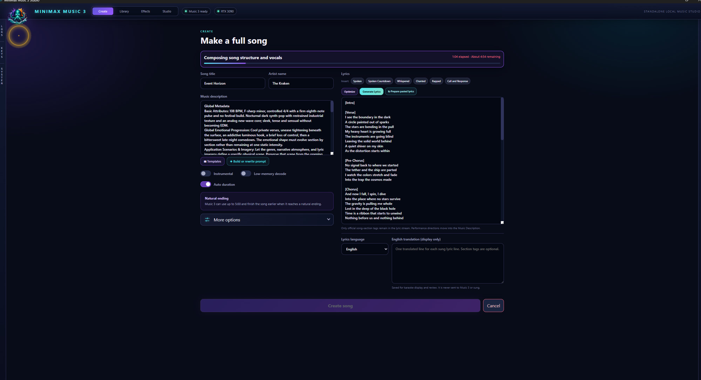

Music description and lyrics stay separate. **Generate Lyrics** / **Optimize** can draft tagged lyrics when Writing is enabled in KEYS. **Create song** runs the local Music 3 worker (compose + refine). The WAV is saved under the song title, not `song.wav`.

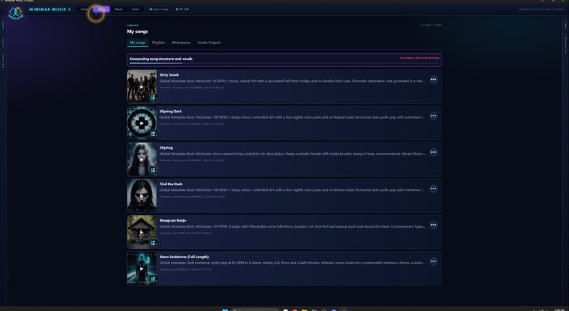

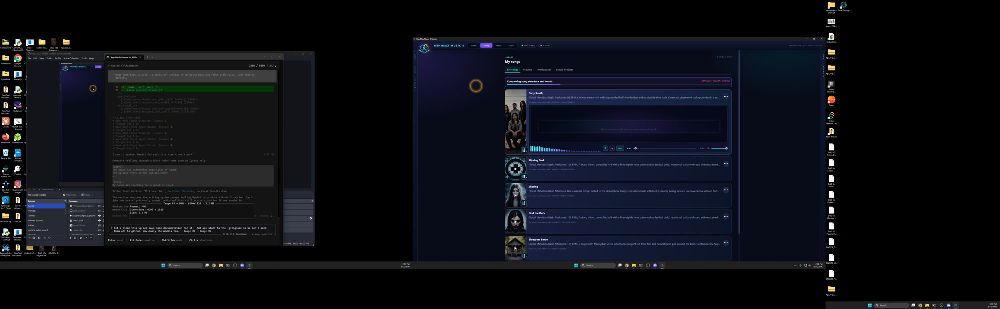

The library holds every local generation with cover, seed, and details. Timed lyrics scroll on the card when you have synced them.

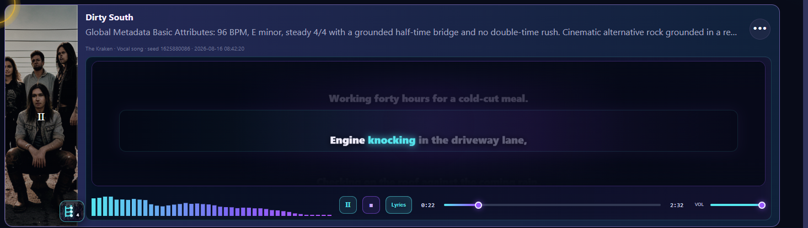

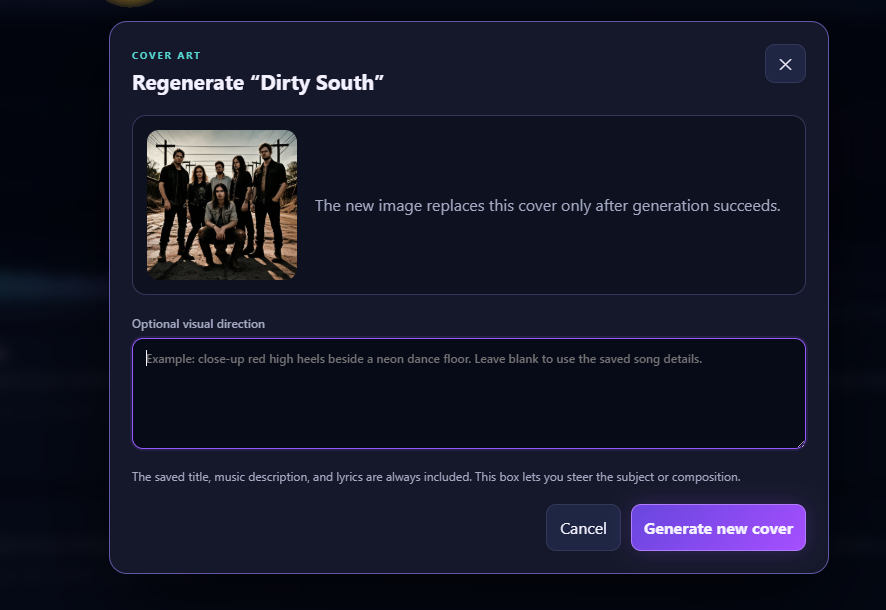

Cover art is local SD 1.5 by default (1:1). Optional visual direction stays in the popup. Cloud image keys, when added later, stay opt-in.

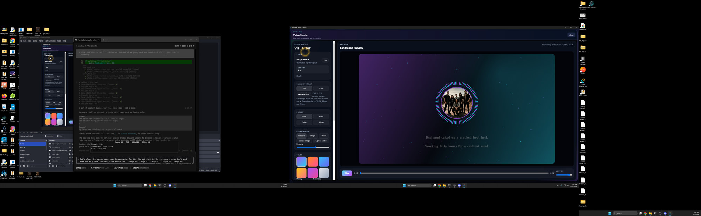

**Make video** opens the local Video Studio (16:9 or 9:16 lyric visualizer + MP4). Cloud video keys are a later opt-in, not a replacement.

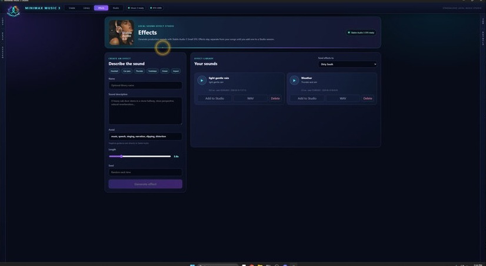

**Effects** is the local Stable Audio SFX library (rain, thunder, hits). Generate, preview, then **Add to Studio**.

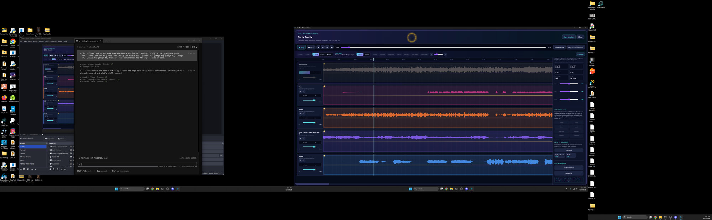

**Studio** is the clip timeline: original mix plus Vocals / Drums / Bass / Other, Mute/Solo, This Lane / All, fades, and export.

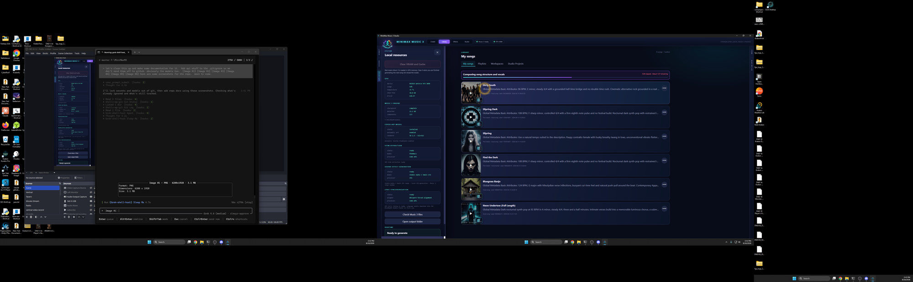

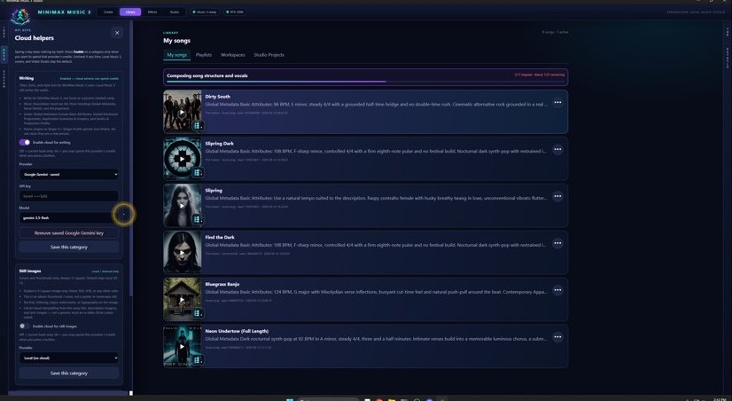

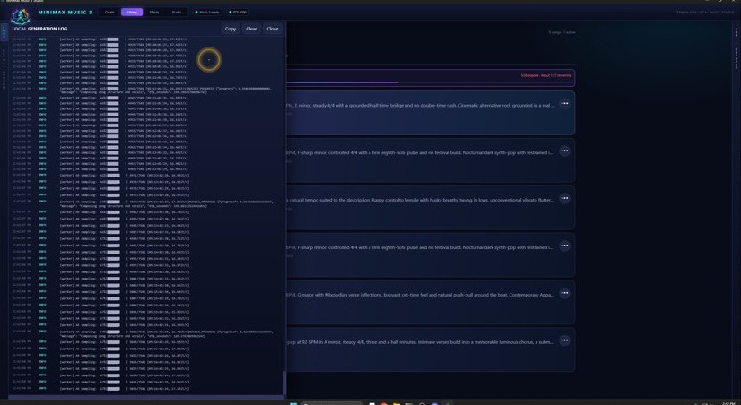

Left rail: **LOGS**, **KEYS** (vaulted cloud helpers, Enable per category), **SYSTEM** (VRAM, models, stems, SFX, lyric sync).

More screenshots can drop into `docs/screenshots/`.

## What is local vs optional cloud

| Always local | Optional (KEYS tab) |
|---|---|
| Music 3 song generation | Writing: titles, Generate Lyrics, Optimize |
| Stem split (Demucs) | Cloud covers (not wired yet; local SD 1.5 is default) |
| Cover thumbnails (SD 1.5) | Cloud video (not wired yet; local Video Studio is default) |
| Sound effects, lyric sync, Studio mix | — |

Optional Writing helpers stay off until you enable them in KEYS. See [docs/api-keys.md](docs/api-keys.md).

## Current stack

- Tauri 2 + React desktop host. Closing the app kills the Python sidecar and GPU worker tree.
- Sidecar on `127.0.0.1:7784`: queue, cancel, library, Studio bounce, Video Studio.
- INT8 Music 3 on a single RTX 3090. **Low-memory decode is off by default** (full decode). Turn it on only if VRAM is tight.
- Native Studio: clip timeline, This Lane / All lanes, fades, library drops, titled WAV export.

## Setup

```text
Setup MiniMax Music 3.bat
```

Creates the private CUDA runtime and downloads the three optimized files from [Comfy-Org/MiniMax-Music-3](https://huggingface.co/Comfy-Org/MiniMax-Music-3) (~11.1 GiB):

```text
models\
├── diffusion_models\minimax_music3_dit_int8_convrot.safetensors
├── text_encoders\minimax_music3_text_encoder_pruned_int8_convrot.safetensors
└── vae\minimax_music3_dav.safetensors
```

Optional:

- `Setup Lyrics Sync.bat` — WhisperX word timing (`models/lyrics`)
- `Setup Sound Effects.bat` — Stable Audio 3 Small SFX (see `MODEL_DOWNLOADS.md`)

Launch `MiniMax Music 3 Studio.exe` or `Launch MiniMax Music 3.bat`.

Set `MINIMAX_MUSIC3_MODEL_ROOT` if the weights live somewhere else.

## Song actions

From each row’s `…` menu: Studio, Make video, edit details, regenerate cover, sync lyrics, extract stems, playlists / workspaces, download WAV / MP3 / FLAC, open the song folder (selects the titled WAV), delete.

MP3 is LAME V0; FLAC is compression 8. Both embed title, artist, album, genre, year, track, comment, and cover when present.

## Multitrack Studio

Top **Studio** tab, or **Open in Studio** on a song. Four Demucs stems plus the original mix as reference. Clip edit, razor, This Lane / All, fades, SFX from Effects, export mix to the last audible clip.

## Development

```powershell
py -3.11 -m venv python\venv
python\venv\Scripts\python.exe -m pip install -r python\requirements.txt
npm install
npm run tauri dev
```

Use one instance. Port `7784`.

## License note

This repo does not redistribute MiniMax weights. MiniMax Music 3 uses the MiniMax-Music3 Community License. Review it before any commercial use.
